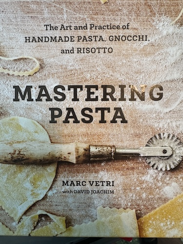

# Recipe HTML Schema for Mastering Pasta

## CRITICAL RULES FOR SCHEMA.ORG MARKUP

### ❌ WRONG - DO NOT DO THIS:
```html
<!-- WRONG: itemprop on parent elements -->
<ul itemprop="recipeIngredient">
    <li>ingredient 1</li>
    <li>ingredient 2</li>
</ul>

<h2 itemprop="recipeInstructions">Instructions</h2>
<ol>
    <li>step 1</li>
    <li>step 2</li>
</ol>
```

### ✅ CORRECT - DO THIS:
```html
<!-- CORRECT: itemprop on each individual list item -->
<ul>
    <li itemprop="recipeIngredient">ingredient 1</li>
    <li itemprop="recipeIngredient">ingredient 2</li>
</ul>

<h2>Instructions</h2>
<ol>
    <li itemprop="recipeInstructions">step 1</li>
    <li itemprop="recipeInstructions">step 2</li>
</ol>
```

## COMPLETE HTML TEMPLATE

```html
<!DOCTYPE html>
<html lang="en">
<head>
    <meta charset="UTF-8">
    <meta name="viewport" content="width=device-width, initial-scale=1.0">
    <title>[Recipe Name]</title>
    <style>
        body {
            font-family: Georgia, serif;
            max-width: 800px;
            margin: 0 auto;
            padding: 20px;
            line-height: 1.6;
            color: #333;
        }
        h1 {
            color: #8B4513;
            font-size: 2em;
            margin-bottom: 10px;
        }
        .recipe-meta {
            color: #666;
            font-style: italic;
            margin-bottom: 20px;
        }
        .description {
            margin: 20px 0;
            font-size: 1.1em;
        }
        h2 {
            color: #8B4513;
            margin-top: 30px;
            border-bottom: 2px solid #8B4513;
            padding-bottom: 5px;
        }
        ul, ol {
            padding-left: 30px;
        }
        li {
            margin-bottom: 10px;
        }
        .note {
            background-color: #f9f4ef;
            padding: 15px;
            border-left: 4px solid #8B4513;
            margin: 20px 0;
        }
    </style>
</head>
<body>
    <article itemscope itemtype="http://schema.org/Recipe">
        
        
        <h1 itemprop="name">[Recipe Name]</h1>
        
        <div class="recipe-meta">
            <span itemprop="recipeYield">[X] servings</span>
        </div>

        <div class="description" itemprop="description">
            <p>[Recipe description from cookbook]</p>
        </div>

        <!-- Optional: Include this only if there's a pasta swap note -->
        <div class="note">
            <strong>Pasta Swap:</strong> [Pasta swap text if applicable]
        </div>

        <h2>Ingredients</h2>
        <ul>
            <li itemprop="recipeIngredient">[ingredient 1]</li>
            <li itemprop="recipeIngredient">[ingredient 2]</li>
            <li itemprop="recipeIngredient">[ingredient 3]</li>
            <!-- Add all ingredients, each with itemprop="recipeIngredient" -->
        </ul>

        <h2>Instructions</h2>
        <ol>
            <li itemprop="recipeInstructions">[instruction step 1]</li>
            <li itemprop="recipeInstructions">[instruction step 2]</li>
            <li itemprop="recipeInstructions">[instruction step 3]</li>
            <!-- Add all instruction steps, each with itemprop="recipeInstructions" -->
        </ol>

        <div class="note">
            <p><strong>Source:</strong> Recipe from <em>Mastering Pasta: The Art and Practice of Handmade Pasta, Gnocchi, and Risotto</em> by Marc Vetri with David Joachim</p>
        </div>
    </article>
</body>
</html>
```

## KEY SCHEMA.ORG ATTRIBUTES

### Required on `<article>` tag:
- `itemscope itemtype="http://schema.org/Recipe"`

### Individual attributes:
- `itemprop="name"` - on recipe title (h1)
- `itemprop="image"` - on image tag
- `itemprop="recipeYield"` - on servings span
- `itemprop="description"` - on description div
- `itemprop="recipeIngredient"` - on EACH ingredient `<li>` tag
- `itemprop="recipeInstructions"` - on EACH instruction `<li>` tag

## FILE NAMING CONVENTION
- Use lowercase with hyphens
- Example: `pici-aglio-e-olio.html`
- NOT: `Pici_Aglio_e_Olio.html`

## IMAGE PATH
- Always use: `IMG_7689.JPG`
- This is relative to the Mastering Pasta folder

## CRITICAL REMINDERS
1. **EACH ingredient list item needs `itemprop="recipeIngredient"`**
2. **EACH instruction list item needs `itemprop="recipeInstructions"`**
3. **Do NOT put itemprop on parent `<ul>`, `<ol>`, or `<h2>` tags**
4. Instructions should be in `<ol>` (ordered list)
5. Ingredients should be in `<ul>` (unordered list)
6. Keep instruction steps as separate `<li>` items - don't combine multiple steps
7. Include blank lines between `<li>` tags for readability in the HTML source

## TOOL TO USE
- Use `Filesystem:write_file` to create the HTML files
- Do NOT use `create_file` (it doesn't work for the actual file system)
